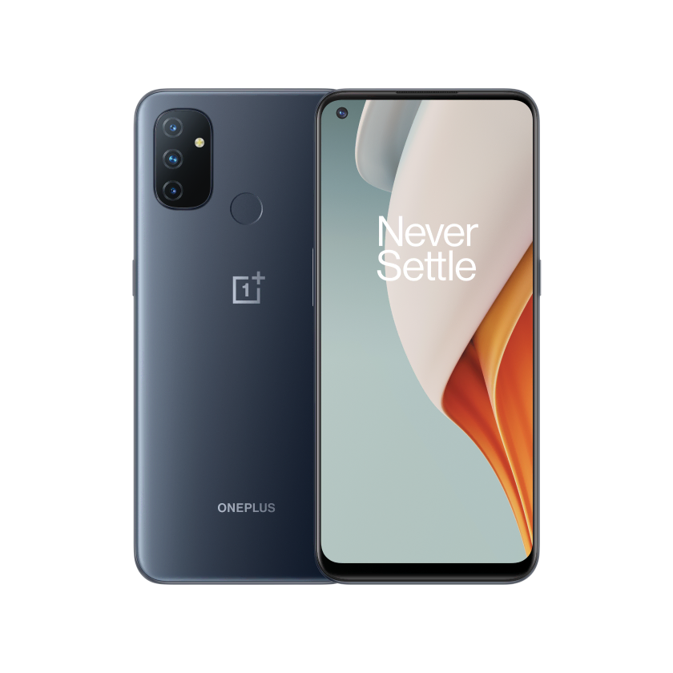
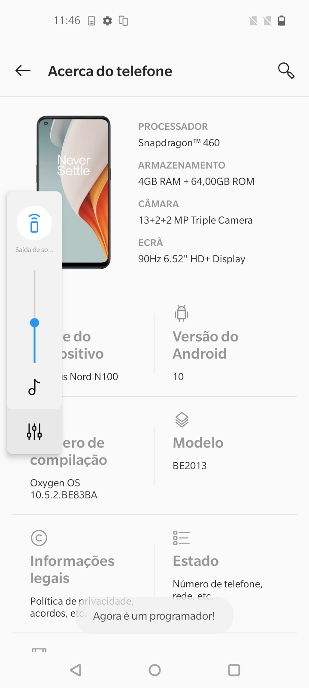
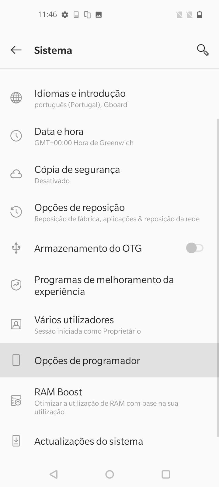

# OnePlus Nord N100
______________________


______________________
OnePlus Nord N100

OnePlus Nord N100 (billie2) specs
==========================================


| Basic                   | Spec Sheet                                                                                                                     |
| -----------------------:|:------------------------------------------------------------------------------------------------------------------------------ |
| CPU                     | Octa-core (4x1.8 GHz Kryo 240 & 4x1.6 GHz Kryo 240)                                                                                                                      |
| Chipset                 | Qualcomm SM4250 Snapdragon 460 (11 nm)                                                                                                            |
| GPU                     | Adreno 610                                                                                                                   |
| Memory                  | 4 GB RAM                                                                                                                     |
| Shipped Android Version | Android 10, OxygenOS 10.5                                                                                                                           |
| Storage                 |64GB                                                                                                                  |
| Battery                 | Li-Po 5000 mAh, non-removable battery                                                                                           |
| Display                 | 720 x 1600 pixels, 20:9 ratio (~269 ppi density)                                                                            |
| Camera (Back)(Main)     | 13 MP, f/2.2, (wide), PDAF 2 MP, f/2.4, (macro) 2 MP, f/2.4, (depth)                                                                                |
| Camera (Front)          | 8 MP, f/2.0
| Kernel Version          | 4.19.95 "People's Front"
| Platform          | bengal

## Firmware
- This builds are based on OxygenOS 10.5.2 for UE and 10.5.3 for Global
- To flash the device is required that device is in EDL mode please check https://community.oneplus.com/thread/1541327

| Region                   | firmware                                                                                                                     |
| -----------------------:|:------------------------------------------------------------------------------------------------------------------------------ |
|EU | BE83BA https://onepluscommunityserver.com/list/Unbrick_Tools/OnePlus_Nord_N100/EU_BE83BA/Q/OnePlus_Nord_N100_EU_OxygenOS_10.5.2.zip
|Global | BE81AA https://onepluscommunityserver.com/list/Unbrick_Tools/OnePlus_Nord_N100/Global_BE81AA/Q/OnePlus_Nord_N100_Global_OxygenOS_10.5.3.zip


## Unsuported Devices/versions/Firmware

 Region                   | firmware                                                                                                                     |
| -----------------------:|:------------------------------------------------------------------------------------------------------------------------------ |
|US Metro by T-Mobile| BE82CF https://onepluscommunityserver.com/list/Unbrick_Tools/OnePlus_Nord_N100/Metro_by_T-Mobile_BE82CF/Q/OnePlus_Nord_N100_Metro-by-T-Mobile_OxygenOS_10.5.8.zip
|US T-Mobile | BE82CB https://onepluscommunityserver.com/list/Unbrick_Tools/OnePlus_Nord_N100/T-Mobile_BE82CB/Q/OnePlus_Nord_N100_T-Mobile_OxygenOS_10.5.8.zip

## Verizon variants dont even try the bootloader is locked and cant be unlocked.

## Unlock bootloader
- Boot the device, do not connect to wifi or create any account we don not need that. Setup the device offline
- Once you boot to the menu go to Settings -> About phone and tap build number until you see " You are now a Developer"
<p float="center">
  
   
</p>

</div>
- Now Connect to wifi network
- Go back to Settings -> System -> Developer Options and enable OEM Unlocking.
- Power off the device VOLUME UP + POWER
- Power on Holding VOLUME UP + POWER to enter FASTBOOT MODE
- Now run the following command:

```console
fastboot flashing unlock
```
- Confirm on the device using the VOLUME keys and the power button to unlock the bootloader.

### Install from CI

- Download latest CI build
- Flash boot.img:
```console
fastboot flash boot ./boot.img
```
- Flash recovery.img:
```console
fastboot flash recovery ./recovery.img
```
- Reboot to fastbootd:
```console
fastboot reboot fastbootd
```
- Format userdata
```console
fastboot format:ext4 userdata
```
- Delete logic partitions:
```console
fastboot delete-logical-partition system_ext_a
fastboot delete-logical-partition system_ext_b
fastboot delete-logical-partition product_a
fastboot delete-logical-partition product_b
fastboot delete-logical-partition system_b
fastboot delete-logical-partition vendor_b
fastboot delete-logical-partition odm_b
```
- Resize system_a partition
```console
fastboot resize-logical-partition system_a 3221225472
```
- Flash ubuntu Rootfs
```console
fastboot flash system_a ./ubuntu.img
```
- Reboot the device
```console
fastboot reboot
```
# What works so far?

### Progress
 Ubuntu 20.04 Focal

- [X] Recovery
- [X] Boot
- [X] Bluetooth
- [X] Camera Fotos and Video Recording
- [X] GPS
- [X] Audio works
- [X] Bluetooth Audio
- [X] Waydroid
- [X] MTP
- [X] ADB
- [X] SSH
- [X] Online charge
- [X] Offline Charge
- [X] Wifi
- [X] Calls
- [X] Mobile Data 2G/3G/4G (LTE)
- [X] Ofono
- [X] SDCard
- [X] Wireless display
- [X] Fingerprint Reader
- [X] OTG Works
- [X] Camera Flash
- [X] Manual Brightness Works
- [X] Switching between cameras
- [X] Hardware video playback
- [X] Rotation
- [X] Proximity sensor
- [X] Virtualization
- [X] GPU
- [X] Lightsensor
- [X] Proximity sensor
- [X] Automatic brightness
- [X] Torch
- [X] Hotspot
- [X] Airplane Mode

## Im not endorsed or founded by UBports Foundation and i do this for fun but does take time work and resources, so if you want to support and apreciate my work pleaso do Donate:
___________________________________
<center>
<a href="https://paypal.me/rubencarneiro?locale.x=pt_PT" title="PayPal" onclick="javascript:window.open('https://paypal.me/rubencarneiro?locale.x=pt_PT','WIPaypal','toolbar=no, location=no, directories=no, status=no, menubar=no, scrollbars=yes, resizable=yes, width=1060, height=700'); return false;"></a>
